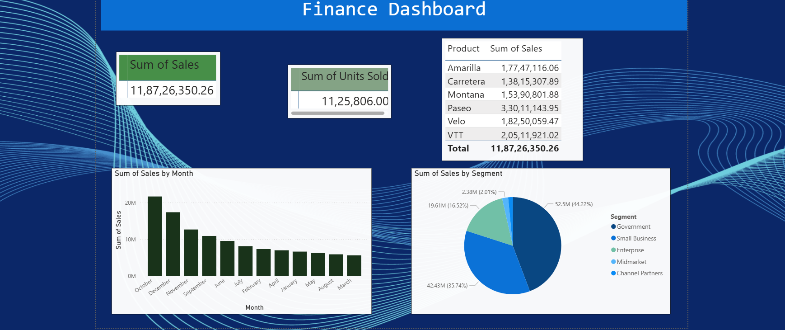
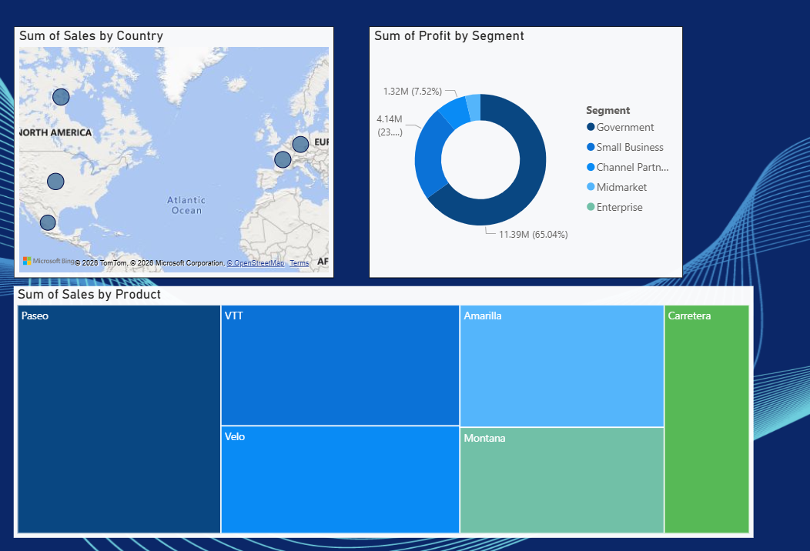

# 📊 Power BI Finance Dashboard

## 📌 Project Overview

This project is an interactive **Finance Dashboard developed using Microsoft Power BI**.

The dashboard provides insights into sales performance, product analysis, customer segments, monthly sales trends, profitability, and geographical sales distribution.

---

## 🎯 Business Objective

The objective of this dashboard is to transform financial and sales data into meaningful visual insights that can support business performance analysis and data-driven decision-making.

---

## 📊 Dashboard Features

- 💰 Total Sales KPI
- 📦 Total Units Sold KPI
- 🛍️ Product-wise Sales Analysis
- 📅 Monthly Sales Trend
- 🌍 Sales by Country / Segment
- 💵 Profit by Segment
- 🗺️ Country-wise Sales Map
- 📈 Product Sales Trend
- 🔎 Interactive Dashboard Analysis

---

## 🛠️ Tools & Technologies

- Microsoft Power BI
- Power Query
- DAX
- Microsoft Excel

---

## 🖥️ Dashboard Preview

### Dashboard Page 1

### Dashboard Page 2

---

## 💡 Key Insights

Based on the dashboard analysis:

- The **Government segment contributes the highest sales**.
- **France** is identified as a top-performing market.
- **October** records the highest sales.
- The dashboard enables interactive analysis of sales and profitability across different business dimensions.

---

## 📁 Project Files

- `Finance Dashboard.pbix` — Power BI dashboard file
- `dashboard-page1.png` — Dashboard Page 1 preview
- `dashboard-page2.png` — Dashboard Page 2 preview
- `README.md` — Project documentation

---

## 🧠 Skills Demonstrated

- Data Cleaning
- Data Analysis
- Data Modeling
- DAX
- Power Query
- Data Visualization
- KPI Development
- Business Intelligence
- Interactive Dashboard Development
- Business Reporting

---

## 👩‍💻 Author

**Nikhila Neeli**

Aspiring Data Analyst | SQL • Excel • Python • Power BI

[LinkedIn](https://www.linkedin.com/in/neeli-nikhila-06b8362a1/)
